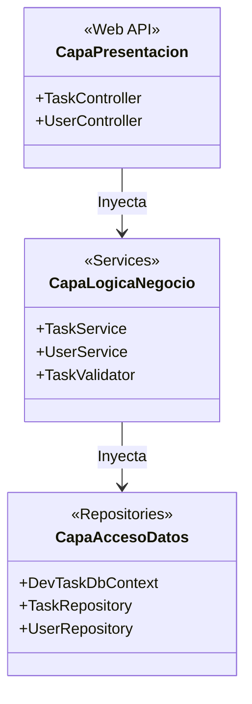
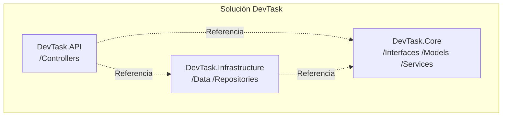
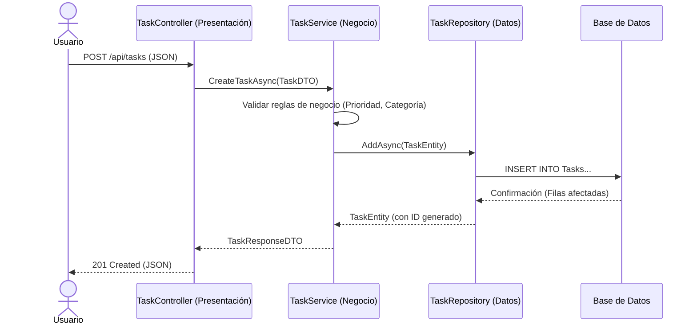
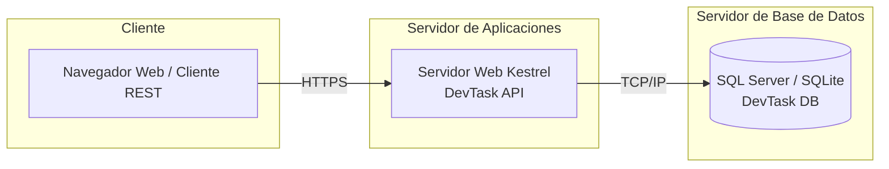

# ADR-02: Definición de las Vistas Arquitectónicas del Sistema

| Campo  | Valor |
|--------|-------|
| Autor  | Sergio Orion Huerta Martínez |
| Fecha  | 05/06/2026 |
| Estado | `Propuesto` |

---

## Contexto

Como continuidad al diseño de **DevTask** (sistema de gestión de tareas dirigido a estudiantes y desarrolladores establecido en el ADR-01), es necesario comunicar formalmente la estructura y comportamiento del sistema antes de la fase intensiva de codificación. Dado que el proyecto se rige bajo una arquitectura de 3 capas utilizando ASP.NET Core y Entity Framework Core, necesitamos una representación visual estándar que documente el sistema desde diferentes perspectivas (lógica, física, despliegue y procesos) para satisfacer los requerimientos de la asignatura y asegurar que todo el equipo comparta la misma visión técnica.

---

## Decisión
Se ha decidido adoptar el **Modelo de Vistas Arquitectónicas**. Se han seleccionado e implementado específicamente 4 vistas: **Lógica, Física, de Procesos y de Despliegue**, las cuales se detallan a continuación.

### ¿Por qué se eligieron estas vistas?

La elección de estas cuatro vistas responde a la necesidad de evaluar y entender el proyecto **DevTask** desde perspectivas completamente distintas y complementarias, evitando la ambigüedad en el desarrollo:

1. **Vista Lógica (Estructura Estática):** Se eligió para modelar cómo se dividen las responsabilidades del negocio a nivel de diseño de software. Permite visualizar claramente cómo la API (Presentación), los Servicios (Lógica) y los Repositorios (Acceso a Datos) interactúan de forma lineal y ordenada, validando el cumplimiento del patrón de 3 capas.
2. **Vista Física / Componentes (Organización del Código):** Se eligió porque en ASP.NET Core la teoría debe traducirse en proyectos reales dentro de una solución (`.sln`). Esta vista justifica la existencia y las dependencias de los assemblies independientes (`DevTask.API`, `DevTask.Core` y `DevTask.Infrastructure`), asegurando que no existan dependencias circulares que rompan la compilación.
3. **Vista de Procesos (Comportamiento Dinámico):** No basta con saber dónde están las clases; se requiere entender cómo interactúan en tiempo de ejecución. Esta vista se eligió para mapear el ciclo de vida de una petición HTTP (como el flujo de creación de una tarea), mostrando visualmente la validación de reglas de negocio y la persistencia de datos.
4. **Vista de Despliegue (Infraestructura):** Se eligió para definir el entorno físico y de ejecución real donde vivirá la aplicación. Permite visualizar la topología cliente-servidor, identificando el rol del servidor web Kestrel y el motor de base de datos (SQL Server / SQLite), lo cual es crucial para planificar el despliegue final.

### Alternativas consideradas

| Alternativa | Por qué la descarté |
|-------------|---------------------|
| **Representación única mediante Diagrama de Clases** | Un solo diagrama estático de clases omitiría por completo el comportamiento dinámico de las peticiones en tiempo de ejecución y la distribución de la infraestructura, dejando vacíos críticos en la planificación del despliegue y la configuración de los servidores. |
| **Modelado Ad-hoc sin vistas estándar** | Documentar el sistema mediante descripciones informales o diagramas libres genera ambigüedad. Al no separar las inquietudes de infraestructura (despliegue) de las inquietudes de diseño lógico, se incrementa el riesgo de introducir dependencias circulares durante la fase de codificación. |
| **Modelo C4 Completo (Nivel 4 - Código)** | Aunque es un modelo basado en niveles, profundizar hasta el nivel de código detallado resulta excesivamente burocrático y redundante para el alcance actual de DevTask, consumiendo tiempo que debe asignarse a la implementación de las reglas de negocio. |

---

## Consecuencias

**Lo que gano:**

- **Consecuencia técnica:** Mitigación de errores de diseño. Al validar el sistema desde cuatro frentes distintos, se garantiza que la separación de las 3 capas se mantenga intacta en el código, en la ejecución y en el servidor físico.
- **Consecuencia sobre el proceso o el equipo:** Claridad y concordancia en el desarrollo. Cada sección del documento proporciona una guía directa para tareas específicas: la vista física guía la creación de archivos, la lógica guía las interfaces, la de procesos guía los controladores y la de despliegue guía el entorno de ejecución.

**Lo que sacrifico o asumo:**

- **Limitación técnica:** Mayor esfuerzo de abstracción inicial. Documentar cuatro planos distintos de un mismo sistema requiere mantener la coherencia cruzada; un cambio en la lógica de las capas obliga a revisar la vista física y la de procesos para evitar inconsistencias.
- **Deuda o riesgo:** Riesgo de desfase en la documentación. Si el sistema evoluciona (por ejemplo, añadiendo microservicios o colas de mensajería) y el equipo modifica el código sin actualizar las vistas correspondientes, el ADR perderá su valor como plano fidedigno de la arquitectura.

---

## Diagramas (Vistas Arquitectónicas)

### 1. Vista Lógica
Muestra la separación de responsabilidades y las dependencias estáticas del sistema basándose en la arquitectura de 3 capas.

### 2. Vista fisica

### 3. Vista de procesos

### 4. Vista de despliegue

